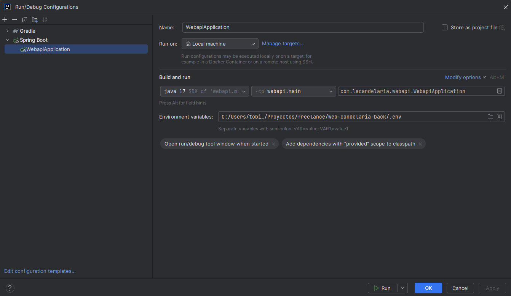

# Enviroment
La API productiva requiere un archivo .env en la raíz del proyecto con las siguientes variables de entorno:  
SPRING_PROFILES_ACTIVE=  
FRONT_URL=""  
API_URL=""  
PROD_DB_URL=  
JWT_SECRET_KEY=  
DB_PASSWORD=

# Docker
Comandos para generar la imagen que utiliza el server
- docker login
- ./gradlew bootJar
- docker build -t tobiasriccone/backend-lacandelaria:latest .
- docker push tobiasriccone/backend-lacandelaria:latest

# Desarrollo
Para correr el proyecto en desarrollo se debe configurar lo siguiente para utilizar el .env:

Para que se visualicen las imagenes por default, copiar el contenido de la carpeta src/main/resources/productsGenericImages en la carpeta /images